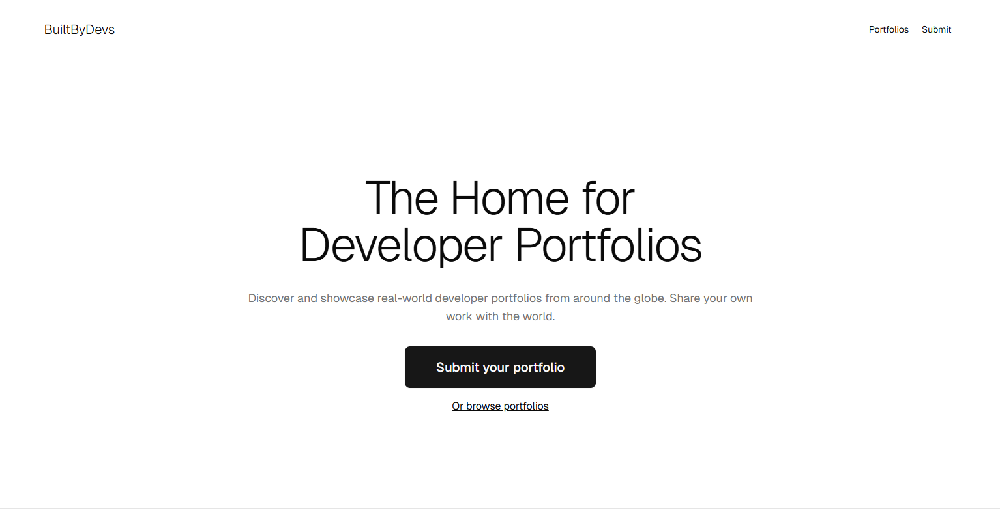

# BuiltbyDevs

**A curated directory of developer portfolios.**  
Showcase your work, explore portfolios by others, and get inspired!

---

## 🌟 What is this?

**BuiltbyDevs** is a growing collection of real developer portfolios from across the globe.  
Whether you're a beginner or experienced dev, you can:

- 📮 Submit your portfolio
- 🌍 Get discovered by others
- 🔍 Explore fellow developers’ work

---

## ✨ How to Get Featured

1. Head to [**builtbydevs**](https://builtbydevs.vercel.app)
2. Click **“Submit your portfolio”**
3. Fill out a short form with:
   - Your name
   - Portfolio URL
   - Tech stack
   - Role/designation
   - Experience
   - Country
   - GitHub profile

4. We review and approve your submission.
5. Once approved, it appears publicly on the site! 🎉

---

## 💡 Why submit?

- ✅ Get visibility for your personal brand
- 🌐 Connect with other developers globally
- 🧠 Inspire others (and get inspired)
- 📁 Become part of a growing portfolio wall

---

## 🖼️ How portfolios look

Each portfolio displays a live thumbnail, your name, stack, country, and GitHub link (if provided).

> *Think of it like a clean, modern wall of devs.*

---

## 🙌 Made by devs, for devs

This project is open, free, and community-powered.  
We believe in showcasing real developer journeys — from learners to pros.

---

### 📣 Submit yours today → [Submit Portfolio](https://builtbydevs.vercel.app/portfolio/submit)

---

## 📬 Want to contribute?

If you're a dev and want to improve this platform, reach out or submit a PR.
